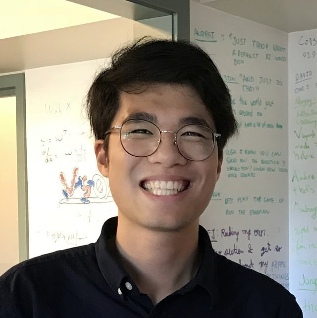

---
# Feel free to add content and custom Front Matter to this file.
# To modify the layout, see https://jekyllrb.com/docs/themes/#overriding-theme-defaults

permalink: /
title: "Towards Generalist Robots:   Learning Paradigms for Scalable Skill Acquisition"
list_title: Home
layout: home
---

Conference on Robot Learning 2023, Atlanta, USA

Monday, Nov 6th, 2023

We have witnessed very impressive progress in large-scale and multi-modal foundation/generative models in recent months. We believe making use of such models in a reasonable way could really enable robots to acquire diverse skills. In the recent <a href="https://arxiv.org/pdf/2305.10455.pdf">white paper</a>, we discussed how we can automate the whole pipeline for robotic skill learning, from low-level asset generation, texture generation, to high-level scene, task and reward generation. Once we obtain such a diverse suite of tasks and environments, we can offload policy training to RL of trajectory optimization to solve all the generated low-level tasks, and finally distill all the learned closed-loop policy into a unified policy model. Apart from scaling up in simulation, how to use real-world data more effectively is another promising research direction. Real-world human demonstrations can be found at scale, but typically only provides spatial trajectory information and doesn't advise how to recover from error compounding during policy rollout.

Motivated by these observations and thoughts, this workshop seeks to discuss and compare the advantages and limitations of different paradigms for scaling up skill learning: scaling up simulation, leveraging generative models, exploiting unstructured passive human demonstration, scaling up structured demonstration collection in the real world, etc.

We aim to discuss questions including, but not limited to:
- Is automating task and scene generation in simulation a valid paradigm to pursue? 
- Are today's simulators capable of simulating diverse physical phenomena that would be encountered in real-world robotic tasks? 
- Is sim2real transfer a major bottleneck? What are the potential solutions to it? 
- What are the pros and cons of collecting learning from real-world data compared to simulated data? 
- How to make collecting and learning from real-world data more efficient and effective? 
- Is there a way to combine the strengths of both simulated and real-world data for learning generalist robots?

&nbsp;
&nbsp;

### Call for papers

We invite submissions including but not limited to the following topics:

- Scaling up robotic data with generative AI

- Exploiting knowledge from vision and language foundation models for robotics

- Scalable skill learning in simulation and sim-to-real transfer

- Scalable real-world data collection and robot learning

- Learning robotic foundation models by leveraging internet-scale data

**Important Dates**
- **Paper submission open**: 2023/09/07

- **Paper submission deadline**: 2023/10/06

- **Notification of acceptance**: 2023/10/16

- **Workshop date**: 2023/11/06

- **Submission portal**: [CoRL 2023 Workshop TGR (OpenReview)](https://openreview.net/group?id=robot-learning.org/CoRL/2023/Workshop/TGR).

We expect submissions with 4 - 8 pages for the main content, with no limit on references/appendices. Submissions are suggested to use the [CoRL template](https://drive.google.com/file/d/1Ksqw_9OMiCKEiGmoaqn3QCuqcRpgtZ5a/view) and must be anonymized. All papers will be peer-reviewed in a double-blind manner. We welcome both unpublished original contributions and recently published relevant works. Accepted papers will be presented in the form of posters, with several papers being selected for spotlight sessions. 

If you have any questions, please contact us at generalistrobots@gmail.com.

&nbsp;
&nbsp;
### Invited Speakers
&nbsp;

    

        <figure>
        
        <figcaption><b>Shuran Song</b> Columbia University</figcaption>
        </figure>
    

    

        <figure>
         
        <figcaption><b>Sergey Levine</b> UC Berkeley</figcaption>
        </figure>
    

    

        <figure>
        
        <figcaption><b>Abhinav Gupta</b> CMU</figcaption>
        </figure>
    

    

        <figure>
        
        <figcaption><b>Dhruv Batra</b> Georgia Tech & Meta AI</figcaption>
        </figure>
    

    

        <figure>
        
        <figcaption><b>Ming C. Lin</b> University of Maryland, College Park</figcaption>
        </figure>
    

    

        <figure>
        
        <figcaption><b>Karen Liu</b> Stanford University</figcaption>
        </figure>
    

    

        <figure>
        
        <figcaption><b>Chuang Gan</b> UMass Amherst & MIT-IBM AI Lab</figcaption>
        </figure>
    

    

        <figure>
        
        <figcaption><b>He Wang</b> Peking University</figcaption>
        </figure>
    

    

        <figure>
        
        <figcaption><b>Dieter Fox</b> University of Washington & Nvidia</figcaption>
        </figure>
    

    

        <figure>
        
        <figcaption><b>Davide Scaramuzza</b> University of Zurich</figcaption>
        </figure>
    

&nbsp;

### Organizers
&nbsp;

    

        <figure>
        
        <figcaption><b>Zhou Xian</b> CMU</figcaption>
        </figure>
    

    

        <figure>
         
        <figcaption><b>Theophile Gervet</b> CMU</figcaption>
        </figure>
    

    

        <figure>
        
        <figcaption><b>Zhenjia Xu</b> Columbia University</figcaption>
        </figure>
    

    

        <figure>
        
        <figcaption><b>Yi-Ling Qiao</b> UMD, College Park</figcaption>
        </figure>
    

    

        <figure>
        
        <figcaption><b>Tsun-Hsuan Wang</b> MIT</figcaption>
        </figure>
    

    

        <figure>
        
        <figcaption><b>Yian Wang</b> UMass Amherst</figcaption>
        </figure>
    

    

        <figure>
        
        <figcaption><b>Chen Wang</b> Stanford University</figcaption>
        </figure>
    

    

        <figure>
        
        <figcaption><b>Katerina Fragkiadaki</b> CMU</figcaption>
        </figure>
    

    

        <figure>
        
        <figcaption><b>David Held</b> CMU</figcaption>
        </figure>
    

    

        <figure>
        
        <figcaption><b>Chris Atkeson</b> CMU</figcaption>
        </figure>
    

    

        <figure>
        
        <figcaption><b>Josh Tenenbaum</b> MIT</figcaption>
        </figure>
    

    

        <figure>
        
        <figcaption><b>Daniela Rus</b> MIT</figcaption>
        </figure>
    

